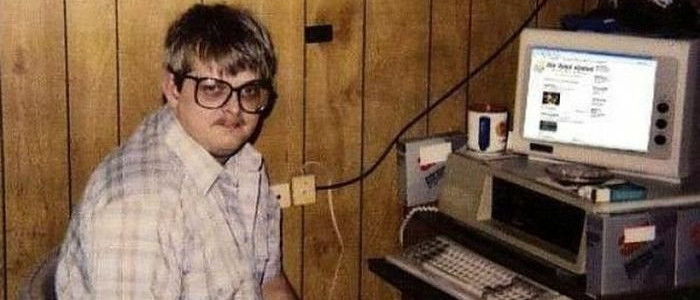

# Привет

Для быстрого предпросмотра заходите на [сюда](https://pimenov.dev/test-task/dist/levi.html) или [сюда](https://pimenov.dev/test-task/dist/bruno.html)

Чтобы запустить это добро:
1. Установите Parcel: `npm install -g parcel-bundler`
2. Затем запустите: `parcel src/*.html`
3. И откройте http://localhost:1234/levi.html либо http://localhost:1234/bruno.html

Чтобы сделать production build с минификацией, обфускацией, ~~блэкджек и шлюхами~~ запустите: `parcel build src/*.html --public-url ./`

Чтобы поменять дизайн header'а можете убрать или добавить класс `isColumn` к header'у прямо в devtools.

Что ещё сказать. Я делал это поздно и быстро. В целом, можно и лучше (но ради тестового слишком стараться - вредно). Но вы зацените accessibility! Просто потабайте туда сюда по пункатам меню. Вооот!

**Короче, я иду спать.**

